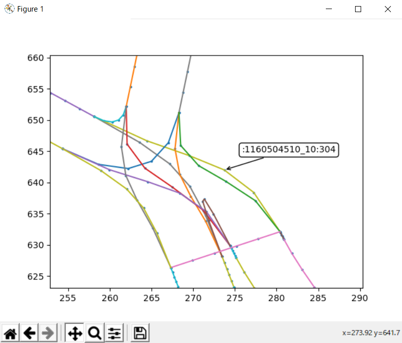

# opendrive_viewer

Opendrive_viewer can display files in OpenDrive format.


# DEMO


 
# Features
 
Display simply.
You can confirm the road ID and name by mouse over.
Python Program.
 
# Requirement
 
*Python 2.* or 3.*
*xml
*numpy
*matplotlib
*math
*sys
*os
*.xodr

# Installation
 
```bash
pip install numpy matplotlib 
```
 
# Usage
 
```bash
git clone https://github.com/FushimaTakesato/opendrive_viewer.git
cd opendrive_viewer
python opendrive_viewer.py test.xodr
```
 
# Note
 
Arc, Spiral and Poly3 are not yet supported.
 
# Author
 
* Takesato Fushima
* takenokonosato.f@gmail.com
 
# License

"opendrive_viewer" is under [MIT license](https://en.wikipedia.org/wiki/MIT_License).

